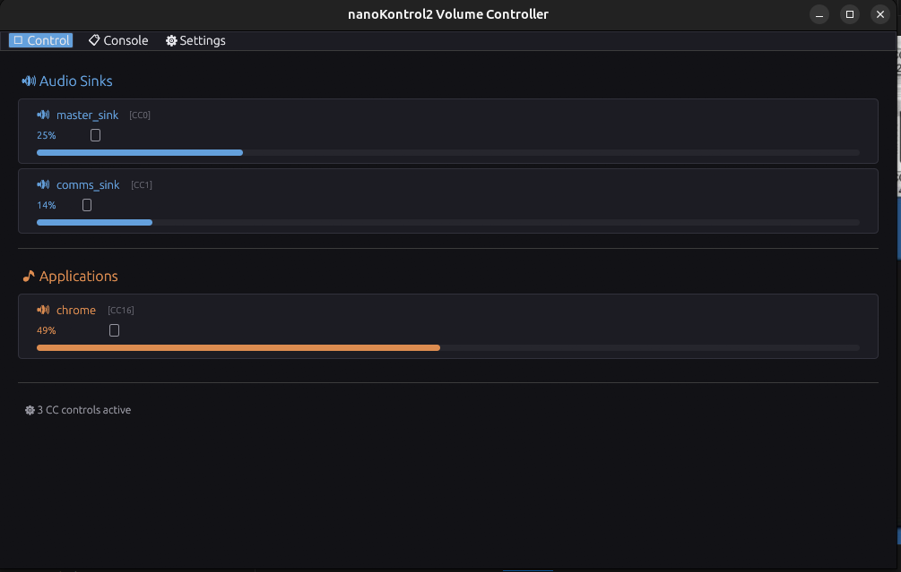
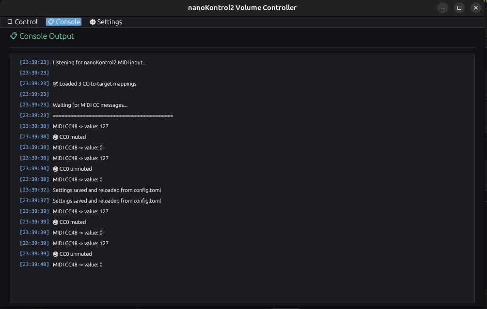
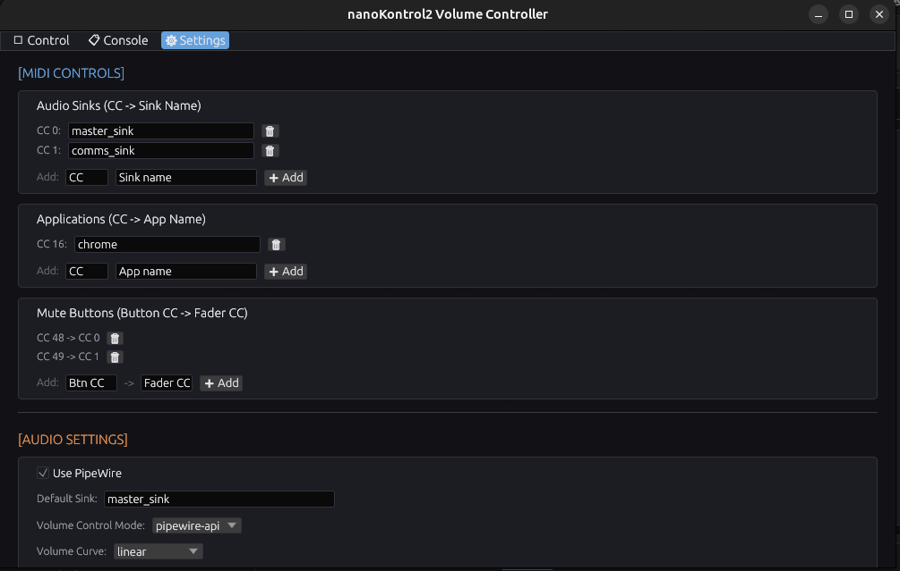

# nanoKontrol2 MIDI Volume Controller for PipeWire

A Rust application that allows you to control PipeWire audio volume using faders on a Korg nanoKontrol2 MIDI controller. Features a real-time UI showing fader positions and console output.

## Screenshots





## Features

- **Control audio volume** with nanoKontrol2 faders
- **Control multiple sinks and applications** individually
- **Mute/unmute** with button support and LED feedback
- **Visual display** with volume bars and percentage
- **Settings panel** to configure MIDI mappings and audio preferences
- **Console output** with timestamped MIDI events
- **Real-time synchronization** between device and UI

## Requirements

- Linux system with PipeWire audio server
- Korg nanoKontrol2 MIDI controller (USB connection)
- Rust 1.70+ (for building from source)

## Installation

```bash
chmod +x setup.sh
./setup.sh
```

Or build manually:

```bash
cargo build --release
./target/release/korg-midi-volume
```

## Configuration

Edit `config.toml` to set up your MIDI mappings:

```toml
[midi_controls.sinks]
cc_0 = "master_sink"
cc_1 = "comms_sink"

[midi_controls.applications]
cc_16 = "chrome"

[midi_controls.mute_buttons]
cc_48 = 0
cc_49 = 1

[audio]
volume_control_mode = "pipewire-api"
debounce_ms = 0
```

## Usage

1. Connect nanoKontrol2 via USB
2. Run the application
3. Move faders to control volume
4. Use mute buttons for quick mute/unmute
5. Configure in Settings tab as needed


## License

MIT
