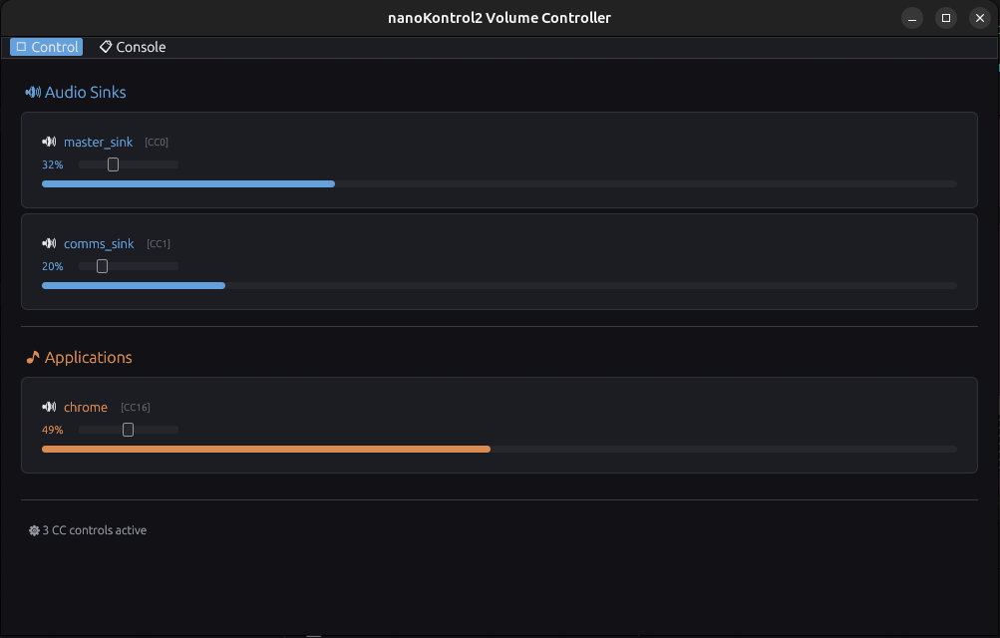

# nanoKontrol2 MIDI Volume Controller for PipeWire

A Rust application that allows you to control PipeWire audio volume using faders on a Korg nanoKontrol2 MIDI controller. Features a real-time UI showing fader positions and console output.



## Features

- 🎚️ **Real-time Fader Visualization**: Multiple audio sinks and applications with live value display
- 📊 **Visual Volume Bars**: Percentage display with colored bars for each fader
- 🔇 **Mute Buttons**: Individual mute/unmute buttons for each fader with LED feedback
- 🎵 **PipeWire Integration**: Direct control of audio volume via PipeWire
- 💬 **Console Output Tab**: Timestamped log of all MIDI events and system messages
- 🖥️ **Modern UI**: Built with egui for smooth immediate-mode rendering at 60+ FPS
- ⚡ **Responsive**: Zero-debounce MIDI response for instant control
- ⚙️ **Configurable**: TOML-based configuration for custom CC mappings
- 🔄 **Bidirectional Control**: Physical device ↔ UI slider synchronization

## Requirements

- Linux system with PipeWire audio server
- Korg nanoKontrol2 MIDI controller (USB connection)
- Rust 1.70+ (for building from source)

## Installation

### Quick Install

```bash
chmod +x setup.sh
./setup.sh
```

This will:
- Build the release binary
- Install to `/usr/local/bin/korg-midi-volume`
- Install desktop file and icon

### Uninstall

```bash
./setup.sh uninstall
```

### Development

For development and testing, use the run script:

```bash
chmod +x run.sh
./run.sh
```

This builds and runs the debug version from the project directory.

### Manual Build

```bash
cargo build --release
./target/release/korg-midi-volume
```

## Configuration

The application looks for `config.toml` in the following order:
1. Current directory (`./config.toml`)
2. `~/.bin/audio/nanokontrol2/config.toml`

### Example Configuration

```toml
[midi_controls.sinks]
cc_0 = "master_sink"  # CC0 controls default sink
cc_1 = "comms_sink"   # CC1 controls communications sink

[midi_controls.applications]
cc_16 = "chrome"      # CC16 controls Chrome volume

[midi_controls.mute_buttons]
cc_48 = 0  # Button 1 mutes CC0 fader
cc_49 = 1  # Button 2 mutes CC1 fader

[audio]
use_pipewire = true
volume_control_mode = "pipewire-api"  # or "pw-volume"
volume_curve = "linear"
debounce_ms = 0

[ui]
window_width = 1000
window_height = 600
show_console = true
max_console_lines = 1000

[logging]
enabled = true
```

## Usage

1. Connect your nanoKontrol2 to your Linux system via USB
2. Run `korg-midi-volume` from terminal or applications menu
3. The app will detect the nanoKontrol2 device automatically
4. Move the faders to control audio volume
5. Press mute buttons for quick mute/unmute with LED feedback

### UI Tabs

- **Control Tab**: Shows all fader values with visual bars (default)
- **Console Tab**: Displays timestamped log of MIDI events and system messages

## Project Structure

```
korg/
├── Cargo.toml                  # Dependencies
├── config.toml                 # Configuration file
├── setup.sh                    # Install/uninstall script
├── korg-midi-volume.desktop    # Desktop entry file
├── assets/
│   └── logo.png                # Application icon
├── src/
│   ├── main.rs                 # Application entry point
│   ├── app.rs                  # Main app state & logic
│   ├── config.rs               # Configuration parsing
│   ├── midi.rs                 # MIDI listener implementation
│   ├── pipewire_control.rs     # PipeWire volume control
│   └── ui.rs                   # egui UI components
└── README.md                   # This file
```

## Troubleshooting

### Device Not Found

1. Ensure the device is connected: `aconnect -l`
2. Check user permissions: `sudo usermod -aG audio $USER` (log out/in)

### No Volume Changes

1. Check PipeWire is running: `systemctl --user status pipewire`
2. Verify volume control mode in config.toml

### Icon Not Showing in Drawer

Log out and log back in to refresh the icon cache.

## License

MIT
