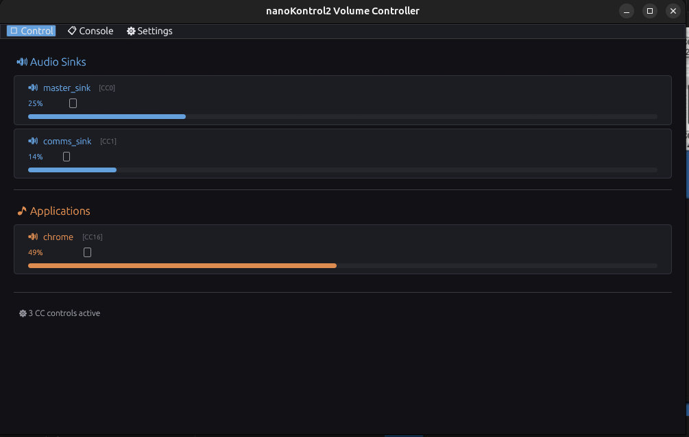
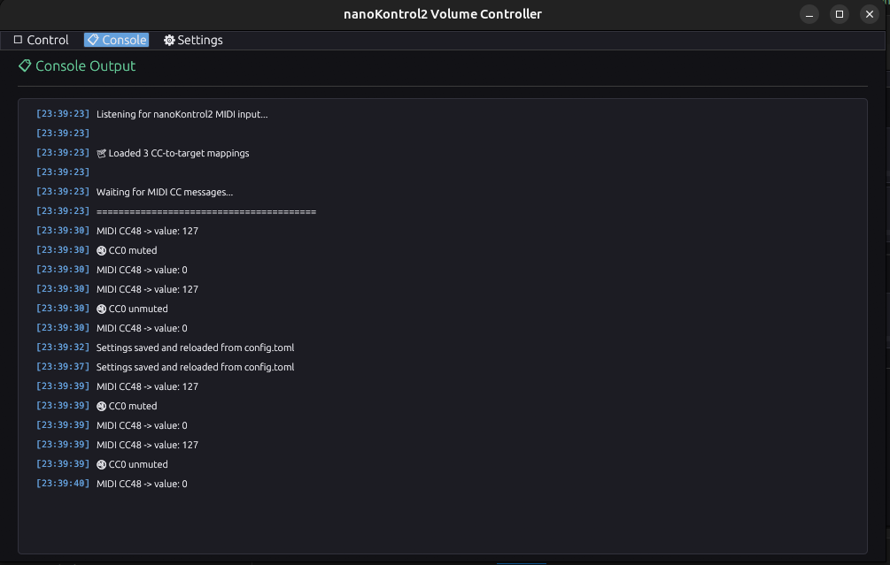
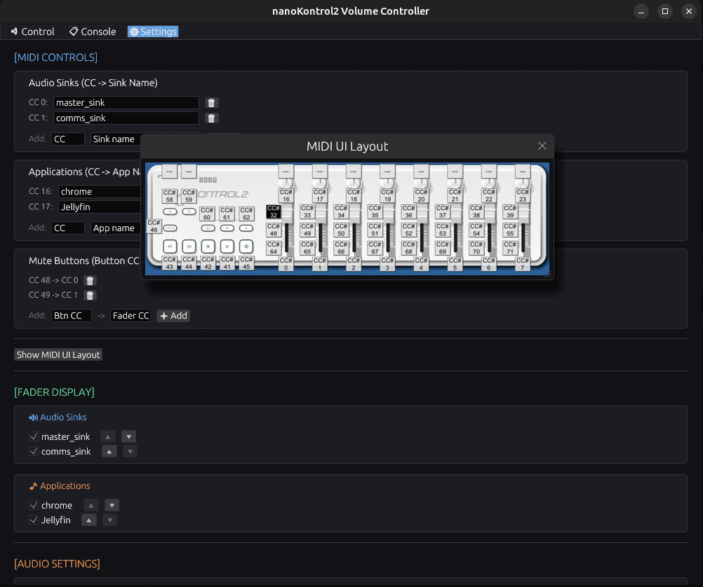
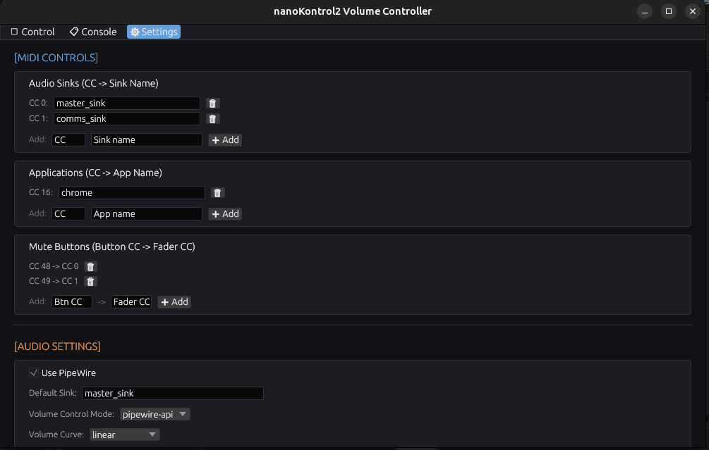

# nanoKontrol2 MIDI Volume Controller for PipeWire

A Rust application that allows you to control PipeWire audio volume using faders on a Korg nanoKontrol2 MIDI controller. Features a real-time UI showing fader positions, a spectrum analyzer, and waterfall display.

## Screenshots






## Features

- **Control audio volume** with nanoKontrol2 faders
- **Multi-input app control** — a single fader controls ALL tabs/streams of an application (e.g., all Firefox tabs) routed to the configured sink
- **Input count display** — shows `(N inputs)` next to app faders indicating how many active streams are being controlled
- **Mute/unmute** with button support and LED feedback
- **Visual display** with volume bars and percentage
- **Real-time audio spectrum analyzer** with frequency visualization
- **Waterfall display** showing spectrum history over time
- **Stereo spectrum support** with separate left and right channel analysis
- **Multiple visualization modes** including bar graph and waterfall display
- **Settings panel** to configure MIDI mappings and audio preferences
- **Hot-reload** — settings are applied immediately without restarting the app
- **Console output** with timestamped MIDI events and logging
- **Real-time synchronization** between device and UI
- **Customizable UI themes** for personalized appearance
- **Configurable volume curves** for precise control mapping
- **Debounce controls** to optimize responsiveness
- **Device availability tracking** for connected sinks and applications
- **MIDI UI reference panel** showing nanoKontrol2 layout

## Requirements

- Linux system with PipeWire audio server
- Korg nanoKontrol2 MIDI controller (USB connection)
- Rust 1.70+ (for building from source)

## Installation

```bash
chmod +x setup.sh
./setup.sh
```

Or build manually:

```bash
cargo build --release
./target/release/korg-midi-volume
```

## Configuration

The configuration file is located at `~/.bin/audio/nanokontrol2/config.toml` (preferred) or `config.toml` in the project directory.

```toml
[midi_controls.sinks]
cc_0 = "master_sink"
cc_1 = "comms_sink"

[midi_controls.applications]
cc_16 = "chrome"
cc_17 = "firefox"

[midi_controls.mute_buttons]
cc_48 = 0
cc_49 = 1

[audio]
default_sink = "master_sink"
volume_control_mode = "pipewire-api"
debounce_ms = 0
```

### Key settings

- **`default_sink`** — All application volume operations are filtered to this sink. Only streams routed to this sink will respond to the app fader.
- **`volume_control_mode`** — Use `"pipewire-api"` for direct control.

## Usage

1. Connect nanoKontrol2 via USB
2. Run the application
3. Move faders to control volume
4. Use mute buttons for quick mute/unmute
5. Configure in Settings tab as needed — changes are applied immediately

### Virtual Sink Setup

For flexible routing, create virtual sinks with `audio_sinks.sh`:

```bash
./audio_sinks.sh
```

This creates `master_sink` and `comms_sink` virtual sinks, both loopbacked to your physical audio output. Set `default_sink = "master_sink"` in config to control all app streams routed through the master sink.

## License

MIT
